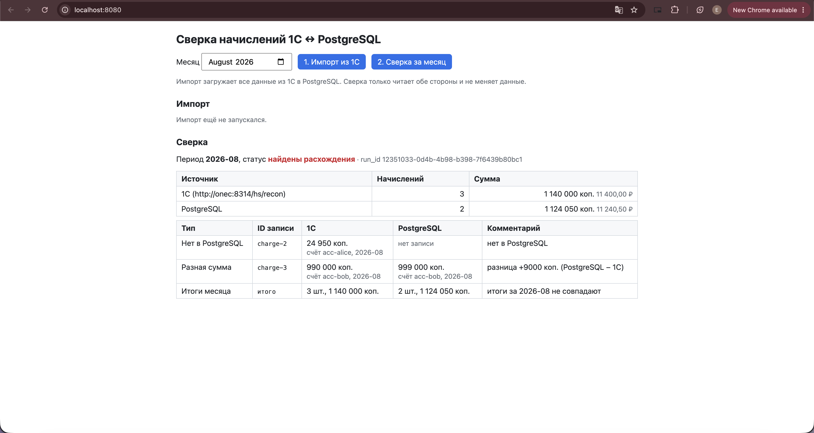

# recon-agent: сверка начислений 1С ↔ PostgreSQL

Сервис проверяет перенос данных из 1С в отчётную PostgreSQL. Пользователь на веб-странице
запускает импорт и сверку за месяц. CLI-агент (Claude Code) через read-only инструменты
читает оба источника, запускает ту же сверку и объясняет расхождения. Условие —
[fullstack.pdf](fullstack.pdf), контракт источника — [CONTRACT.md](CONTRACT.md).

```
1С 8.3.27 (ibsrv, HTTP-сервис ReconAPI, пользователь reader) ─┐
                                                              ├─► recon (Python): импорт, правила, сверка
PostgreSQL 17 (роли importer / agent_reader) ─────────────────┘        │
                                                   ┌───────────────────┼────────────────────┐
                                          FastAPI + React (app)   CLI python -m recon   MCP-сервер recon
                                                                                       └─► субагент recon-analyst
```

Логика проверок одна — `recon/importer.py` и `recon/reconcile.py`. Её вызывают и
веб-страница (через API), и агент (через MCP), и CLI.

## Содержание репозитория

| Путь | Что там |
|---|---|
| `onec/` | 1С: Dockerfile сервера, исходники конфигурации (`config/`), `restore.sh`, настройки `ibsrv` |
| `db/schema.sql` | схема отчётной БД |
| `recon/` | backend: источник, импорт, правила (`rules/`), сверка, API, инструменты агента, MCP-сервер |
| `frontend/` | веб-страница (React + TypeScript, Vite) |
| `tests/` | автотесты (pytest) |
| `scripts/` | расхождения в PG, проверки 1С, генерация `.env.agent` |
| `.claude/` | субагент `recon-analyst`, скиллы `data-validation` и `recon-report`, права агента |
| `evidence/` | лог реального прогона агента, отчёты сверки, скриншот UI |
| `source/`, `fixtures/`, `postgres/` | стартовый комплект: HTTP mock, эталонные данные, роли PG |
| [TIMELOG.md](TIMELOG.md), [AI_USAGE.md](AI_USAGE.md) | время по этапам и использование AI |

## Требования

- Docker Desktop / Engine с Compose v2. На Apple Silicon — эмуляция amd64 (Rosetta) для 1С.
- Официальный дистрибутив сервера 1С `setup-full-8.3.27.2342-x86_64.run` в папке `onec-dist/`
  (в git не попадает).
- Для локальной разработки и тестов: uv 0.11.6 (Python 3.12 ставит сам), Node.js 24 — только
  если собирать фронтенд вне Docker.

## Запуск

```bash
cp .env.example .env              # заполнить ONEC_PASSWORD и ONEC_ADMIN_PASSWORD (любые)
./onec/restore.sh                 # 1С: собрать образ, создать базу, загрузить фикстуры, запустить
docker compose --profile onec up -d --build --wait   # PostgreSQL, 1С, приложение
```

Страница: **http://localhost:8080**. Порядок работы: «1. Импорт из 1С», затем
«2. Сверка за месяц» (по умолчанию 2026-08). Импорт и сверка — отдельные действия:
сверка только читает обе стороны и не перезаписывает внесённые в PG расхождения.

| Сервис | Адрес на хосте | Внутри Compose |
|---|---|---|
| app (страница + API) | http://localhost:8080 | `app:8000` |
| 1С ReconAPI | http://localhost:8314/hs/recon | `http://onec:8314/hs/recon` |
| PostgreSQL | `localhost:5543/reporting` | `postgres:5432` |
| HTTP mock (не 1С) | http://localhost:8093 | `http://source-mock:8000` |

Без 1С (только для разработки UI, это **не** интеграция с 1С):
`APP_ONEC_BASE_URL=http://source-mock:8000 docker compose up -d --build --wait`.

CLI (из корня, нужен uv):

```bash
uv sync --frozen
uv run --env-file .env python -m recon db-init                     # схема (её создаёт и app при старте)
uv run --env-file .env python -m recon import                      # импорт 1С → PG
uv run --env-file .env python -m recon reconcile --period 2026-08  # сверка, отчёт в artifacts/reports/
uv run --env-file .env python -m recon rules                       # зарегистрированные правила
```

Коды возврата: 0 — успех/расхождений нет, 1 — найдены расхождения или нарушения правил,
2 — ошибка (источник или БД недоступны).

Остановка: `docker compose --profile onec down`. Полный сброс PostgreSQL и базы 1С:
`docker compose --profile onec down -v`, затем снова команды из раздела «Запуск».

## Проверяемые сценарии

| Сценарий из условия | Как проверить | Автотесты |
|---|---|---|
| Первый и повторный импорт | «Импорт» дважды или `python -m recon import` дважды: 2 / 4 / 1 записи, август 1 140 000 коп., дублей нет | `test_import.py` |
| Сверка одинаковых данных | «Сверка» за 2026-08: «Расхождений нет», итоги 3 / 1 140 000 с обеих сторон | `test_reconcile.py`, `test_api.py` |
| Пропуск и изменение суммы | `scripts/pg_discrepancies.py inject` → «Сверка»: `charge-2` нет в PG, `charge-3` 990 000 / 999 000 | `test_reconcile.py`, `test_api.py` |
| Недоступна 1С | `docker compose --profile onec stop onec` → импорт и сверка показывают ошибку, итогов «совпадает» нет | `test_import.py`, `test_reconcile.py`, `test_api.py` |
| Новое правило | `required_account_id` — один файл, см. [ниже](#новое-правило-пример-расширения) | `test_rule_required_account_id.py` |

Расхождения вносятся и устраняются **только в PostgreSQL**, 1С не меняется:

```bash
uv run --env-file .env python scripts/pg_discrepancies.py inject    # удалить charge-2, charge-3 → 999 000
uv run --env-file .env python scripts/pg_discrepancies.py status    # начисления августа в PG
uv run --env-file .env python scripts/pg_discrepancies.py restore   # повторный импорт из 1С
```

## Тесты

```bash
docker compose up -d --wait postgres    # тестам нужна PostgreSQL (отдельная база reporting_test)
uv sync --frozen
uv run pytest                           # 53 теста
uv run ruff check .
cd frontend && npm ci && npm run build && npm run lint
```

Что проверяют автотесты (источник в них подменён `httpx.MockTransport` — моки допустимы в
автотестах; интеграция с 1С подтверждена отдельно, см. раздел «1С» и `evidence/`):

- **импорт**: повтор не меняет данные; восстанавливает строки, изменённые в PG; ошибка
  источника (500, нет `value`, не JSON, недоступен) → `error`, данные не пишутся;
  нарушения правил → `rejected` с ID записи;
- **сверка**: одинаковые данные; пропуск и изменение суммы с ID и значениями обеих сторон;
  лишняя строка и смена счёта; граница периода (сентябрьский `charge-4` не влияет на август);
  ошибки 1С и PG → `error`; сохранение отчёта в БД и файл;
- **API**: импорт и сверка — отдельные действия; ошибка 1С видна пользователю;
- **права**: `agent_reader` не может писать даже после снятия read-only в сеансе; инструменты
  агента отклоняют неизвестные запросы и подозрительные параметры; MCP-сервер не стартует
  с ключом импортёра;
- **новое правило** и сравнение «без правила».

### Smoke UI (вручную)

1. `docker compose --profile onec up -d --build --wait`, открыть http://localhost:8080.
2. «1. Импорт из 1С» → «Импорт выполнен: счетов 2, начислений 4, платежей 1».
3. Месяц August 2026, «2. Сверка за месяц» → «расхождений нет», 1С и PostgreSQL:
   3 начисления, 1 140 000 коп.
4. `scripts/pg_discrepancies.py inject`, снова **только** «Сверка» → таблица:
   `charge-2` «Нет в PostgreSQL» (24 950), `charge-3` «Разная сумма» (990 000 / 999 000,
   +9 000), «Итоги месяца» (1 140 000 / 1 124 050). Скриншот: [evidence/ui-discrepancies.png](evidence/ui-discrepancies.png).
5. `docker compose --profile onec stop onec`, «Сверка» → красный блок «Сверка за 2026-08 не
   выполнена — результат неизвестен» с причиной. Вернуть: `docker compose --profile onec up -d --wait onec`,
   данные PG — `scripts/pg_discrepancies.py restore`.

## Данные и права

### Схема PostgreSQL ([db/schema.sql](db/schema.sql))

| Таблица | Назначение |
|---|---|
| `accounts` | лицевые счета (id из источника, номер) |
| `charges` | начисления: `account_id` → `accounts`, `period` (`YYYY-MM`, CHECK), `amount_kopecks bigint` |
| `payments` | платежи с сохранением ID и связей |
| `import_runs` | журнал импортов: статус `ok` / `rejected` / `error`, счётчики, нарушения, ошибка |
| `recon_runs`, `recon_discrepancies` | отчёты сверок из UI: итоги обеих сторон и расхождения |

Суммы везде целые копейки (`bigint` в БД, `int` в Python); `float` не используется.
Схема создаётся идемпотентно от роли `importer` — поэтому `agent_reader` получает только SELECT.

### Импорт и сверка

- **Импорт** читает все три коллекции 1С, проверяет их правилами валидации и пишет одной
  транзакцией `INSERT … ON CONFLICT (id) DO UPDATE`. Повтор не создаёт дублей. Ошибка
  источника → `error`, нарушения правил → `rejected`; в обоих случаях данные не меняются.
- **Сверка** за месяц читает начисления 1С и PostgreSQL (роль `agent_reader`) и прогоняет
  правила: `missing_in_target`, `missing_in_source`, `amount_mismatch`, `account_mismatch`,
  `totals_mismatch`. Отчёт: `run_id`, период, статус (`ok` / `discrepancies` / `error`),
  количество и сумма по обеим сторонам, расхождения — тип, ID записи, значения с каждой
  стороны. При `error` итоги не выдаются. Арифметику выполняет код, не модель.

### Доступы

| Кто | PostgreSQL | 1С | Где задано |
|---|---|---|---|
| приложение (app), CLI импорта | `importer` (запись) | reader | `compose.yaml`, `.env` |
| сверка, инструменты агента | `agent_reader` (только SELECT, read-only транзакции) | reader (роль ЧтениеДанных) | `.env.agent` |
| восстановление 1С | — | admin (роль ПолныеПрава) | `.env`, только `onec/restore.sh` |

Учётные данные PostgreSQL — публичные учебные из стартового комплекта. Пароли 1С задаются
в `.env` (не коммитится).

## Агент сверки (Claude Code)

Агент сверки — субагент `recon-analyst` ([.claude/agents/recon-analyst.md](.claude/agents/recon-analyst.md)),
у него только инструменты `mcp__recon__*` (без Bash/Edit/Write), поэтому прочитать `.env` или
запустить импорт он не может.

| Инструмент MCP-сервера `recon` | Что делает |
|---|---|
| `onec_read` | чтение 1С (пользователь reader), можно ограничить месяцем |
| `pg_read` | 8 именованных параметризованных SELECT от `agent_reader`; произвольного SQL нет |
| `validate_source` | правила валидации по данным 1С, без импорта |
| `run_reconciliation` | та же сверка, что у страницы; отчёт в `artifacts/reports/` |
| `list_rules` | список правил |

Скиллы: [data-validation](.claude/skills/data-validation/SKILL.md) и
[recon-report](.claude/skills/recon-report/SKILL.md) — условия применения, входные
параметры, команды и проверяемый результат.

Запуск:

```bash
docker compose --profile onec up -d --wait postgres onec   # источники
python3 scripts/make_agent_env.py                           # .env.agent: только read-only ключи
```

1. Открыть Claude Code в корне репозитория (CLI `claude` или вкладка Code в приложении) и
   подтвердить MCP-сервер `recon` из `.mcp.json`.
2. Обратиться к субагенту: `@recon-analyst сверь начисления за август 2026 года между 1С и
   PostgreSQL. Покажи отсутствующие записи и различия в суммах.`

MCP-сервер получает учётки из `.env.agent` и не стартует, если в окружении есть ключ
импортёра PostgreSQL или администратора 1С.

## Демонстрация: UI и реальный прогон агента

Данные — настоящая 1С (`ibsrv`) и отчётная PostgreSQL; расхождения внесены только в PG
(`scripts/pg_discrepancies.py inject`).

- **Веб-страница** после `inject`, нажата только «Сверка за месяц»:
  [evidence/ui-discrepancies.png](evidence/ui-discrepancies.png) — charge-2 нет в PostgreSQL
  (24 950 коп.), charge-3 990 000 / 999 000 коп. (+9 000), итоги 1 140 000 / 1 124 050.

  

- **Агент** (Claude Code, MCP-сервер `recon`, скиллы `recon-report` и `data-validation`):
  [evidence/agent-session.log](evidence/agent-session.log) — сверка за август нашла
  `charge-2` и `charge-3` и перепроверила их чтением 1С и PostgreSQL; проверка данных 1С — `ok`
  по 7 правилам; после восстановления (выполнено пользователем) повторная сверка — `ok`;
  на прямую просьбу запустить импорт агент отказался (роль `agent_reader`, пароля импортёра нет).
- **Субагент сверки `recon-analyst`:** [evidence/agent-subagent.log](evidence/agent-subagent.log)
  (только шаги субагента) — его инструменты: `mcp__recon__*` и `Skill`, без Bash/Read/Write/Edit;
  сверка за август — `ok` (3 начисления, 1 140 000 коп. с обеих сторон, перепроверено чтением
  1С и PostgreSQL); на «Запусти импорт» — «у меня нет для этого инструмента».
  Первый прогон (`agent-session.log`) сделан в основной сессии до появления субагента.
- **Отчёты агента:** [evidence/reports/recon-2026-08-discrepancies.json](evidence/reports/recon-2026-08-discrepancies.json)
  (run_id `198db2c2…`) и [evidence/reports/recon-2026-08-ok.json](evidence/reports/recon-2026-08-ok.json)
  (run_id `03ab6105…`).

## Новое правило: пример расширения

Правила валидации и сверки живут в реестре `recon/rules/`. Правило — функция с декоратором
`@validation_rule(...)` или `@reconcile_rule(...)`; модули пакета подключаются автоматически,
поэтому импорт, сверка, API, UI и агент при добавлении правила не меняются.

Пример — `required_account_id` (у начисления и платежа обязателен ID счёта), коммит `9299650`:

```text
$ git show --stat 9299650
 recon/rules/required_account_id.py     | 19 ++++++++++++++
 tests/test_rule_required_account_id.py | 48 ++++++++++++++++++++++++++++++++++
 2 files changed, 67 insertions(+)
```

Добавлен **один файл кода** и тест к нему. Без правила начисление с `account_id: null`
доходило до PostgreSQL и роняло импорт ошибкой `NotNullViolation`; с правилом импорт
отклоняется заранее (`status: rejected`) с правилом и ID записи. Правило сразу видно
агенту (`list_rules`, `validate_source`) и в UI («Импорт отклонён правилами валидации»).

## 1С: источник данных

**Платформа:** 1С:Предприятие 8.3.27.2342. Сервер для Linux x86_64 — официальный
дистрибутив `setup-full-8.3.27.2342-x86_64.run`, тихая установка компоненты `server`
в Docker-образ (`onec/Dockerfile`). На Apple Silicon работает под эмуляцией amd64 (Rosetta).
Конфигурация разработана в Конфигураторе 8.3.27.2342 для macOS, лицензия — комьюнити.
Дистрибутив кладётся в `onec-dist/` (в git и в Docker-контекст приложения не попадает).

**Схема:** автономный сервер `ibsrv` + утилита `ibcmd`, файловая база в томе `onec-data`.
Кластер, отдельная СУБД для 1С и Apache не нужны.

| Файл | Назначение |
|---|---|
| `onec/config/` | исходники конфигурации (XML-выгрузка Конфигуратора + модули `.bsl`) |
| `onec/restore.sh` | восстановление базы с нуля и запуск |
| `onec/scripts/restore-inside.sh` | фаза восстановления внутри контейнера |
| `onec/ibsrv/load.yml`, `api.yml` | настройки `ibsrv` для фазы загрузки и рабочей фазы |
| `scripts/onec_check.py` | сравнение данных 1С с `fixtures/data.json` и итогами августа |

Объекты конфигурации: справочники `ЛицевыеСчета`, `Начисления`, `Платежи`; роли
`ПолныеПрава`, `ЧтениеДанных`; HTTP-сервисы `ReconAPI` (GET) и `ReconLoader` (POST).

### Восстановление

`./onec/restore.sh` пересоздаёт базу с нуля; повторный запуск даёт ту же базу. Дальше 1С
стартует как обычный сервис: `docker compose --profile onec up -d --wait onec`.

### Двухфазная публикация: загрузчик доступен только при восстановлении

1. **Фаза восстановления** (`restore-inside.sh`, `load.yml`): `ibcmd` создаёт базу из
   `onec/config`, `ibsrv` слушает **только localhost внутри контейнера** и публикует оба
   HTTP-сервиса. `POST /hs/recon-load/fixtures` загружает `fixtures/data.json` (поиск по
   ВнешнийID, повтор не создаёт дублей) и заводит пользователей. Скрипт грузит дважды и
   сверяет количество, затем проверяет: без пароля — 401, запись под reader — 403.
   `ibsrv` останавливается.
2. **Рабочая фаза** (`api.yml`): `ibsrv` публикует **только ReconAPI**
   (`http-services: publish-by-default: no`). `restore.sh` проверяет снаружи, что GET под
   reader отдаёт 200, а `POST /hs/recon-load/fixtures` — 404, иначе завершается ошибкой.

Загрузчик нужен потому, что `ibcmd` умеет создать базу из XML, но не умеет выполнять код
1С и заводить пользователей. Чтение внутренних таблиц 1С не используется — только HTTP.

### Mapping 1С → контракт

| Контракт | 1С | Преобразование |
|---|---|---|
| accounts.id | Справочник.ЛицевыеСчета.ВнешнийID (Строка 50) | как есть |
| accounts.account_number | ЛицевыеСчета.НомерСчета (Строка 20) | как есть |
| charges.id | Справочник.Начисления.ВнешнийID | как есть |
| charges.account_id | Начисления.ЛицевойСчет (ссылка) | → ВнешнийID счёта; пустая ссылка → `null` |
| charges.period | Начисления.Период (Дата, 1-е число месяца) | `YYYY-MM` |
| charges.amount_kopecks | Начисления.СуммаКопеек (Число 15,0) | целое, копейки |
| payments.id / account_id | Справочник.Платежи.ВнешнийID / ЛицевойСчет | как у начислений |
| payments.date | Платежи.ДатаПлатежа (Дата) | `YYYY-MM-DD` |
| payments.amount_kopecks | Платежи.СуммаКопеек (Число 15,0) | целое, копейки |

Стабильные ID: наружу отдаётся ВнешнийID из фикстур, нативные UUID 1С не публикуются.
Связи внутри 1С — настоящие ссылки. Формат ответа — `{"value": [...]}`, все строки одним
ответом, без пагинации; параметр `$format` игнорируется. Сбой на стороне 1С — HTTP 500, а не
пустой список. Записи с пометкой удаления не отдаются.

### Пользователи и права 1С

| Пользователь (`.env`) | Роль | Права |
|---|---|---|
| `ONEC_USER` (reader) | ЧтениеДанных | Чтение/Просмотр трёх справочников, «Использование» трёх GET-методов ReconAPI |
| `ONEC_ADMIN_USER` (admin) | ПолныеПрава | Администрирование, запись справочников, все методы — только для `restore.sh` |

У обеих ролей нет прав на тонкий и веб-клиент: доступ к базе только через HTTP-сервисы.
Приложению и агенту передаётся только reader.

### Проверки 1С

```bash
uv run --env-file .env python scripts/preflight.py --real
uv run --env-file .env python scripts/onec_check.py
```

Результат 06.10.2026: preflight — `PASS` (accounts 2, charges 4, payments 1);
`onec_check.py` — `PASS`, все записи совпадают с фикстурами, август 2026: 3 начисления,
1 140 000 коп. (10001 — 150 000, 20002 — 990 000). Если 1С недоступна или пароль неверный,
скрипт возвращает `BLOCKED` с кодом 2.

### Лицензия 1С

Комьюнити-лицензия активирована на машине разработчика (MacBook). Сервер 1С (ibsrv)
запущен в Docker на этой же машине; в этом режиме платформа не запросила отдельную
активацию. Файлы лицензии в репозиторий не включены.

Если платформа запросит активацию (ошибка лицензирования в ответе или в
`docker compose logs onec`), это фиксируется как BLOCKED по `ONEC_SETUP.md`.
У контейнера постоянный `hostname` (`recon-onec`); файлы `*.lic` закрыты в `.gitignore`.

## Ограничения и известные особенности

- Сверяются только начисления (по условию); платежи импортируются, но не сверяются.
  Удаления в 1С, CDC и валюты вне задания: импорт — upsert, строки, удалённые в 1С,
  из PostgreSQL не удаляются.
- Фоновые задачи API хранятся в памяти процесса (очередь не требуется по условию): после
  перезапуска `app` статус незавершённых задач теряется, итоги остаются в `import_runs` /
  `recon_runs`. Авторизации у страницы нет — сервис слушает только `127.0.0.1`.
- `ibsrv` после обработанных запросов на SIGINT/SIGTERM пишет «Server stopped», но
  процесс не завершается. Скрипт ждёт эту строку и добивает процесс; в Compose это делает
  `stop_grace_period`. Нужен `init: true`, иначе завершённые процессы остаются зомби.
- Формат раздела `http` в `onec/ibsrv/api.yml` в справке `ibsrv` не описан. Подобран по
  ключам из бинарника и проверен вручную на 8.3.27.2342: GET ReconAPI — 200, ReconLoader — 404.
- В выгрузке язык конфигурации English (так был настроен клиент на Mac); имена объектов
  русские, на работу не влияет.

## Время и использование AI

Время по этапам (1С — лимит 4 ч, приложение — лимит 12 ч): [TIMELOG.md](TIMELOG.md).
Агент, настройки, примеры применения и что проверено вручную: [AI_USAGE.md](AI_USAGE.md).
Инструкции для работы с репозиторием: [CLAUDE.md](CLAUDE.md).
